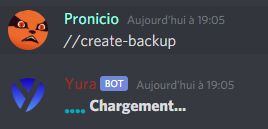

# Système de backup :

Le système de backup sert à sauvegarder votre serveur discord et à le cloner sur un autre !

## 📑 Avec les commandes

Vous pouver utiliser cette fonctionnalité en commande :  
Tapez la commande `//create-backup`. Puis **le bot générera votre backup** :  

Une fois fini de charger le bot vous envera **l'id de la backup en message privée** :

Le message en privé devrait ressembler à ça : `//load-backup 739753818857699680`  
**Il vous suffit donc de taper cette commande dans le serveur que vous voulez et le tour est joué !**

## 💻 Sur le dashboard

Sur le dashboard **c'est encore plus simple** :

  
Il faut vraiment vous dire il faut faire quoi :/
