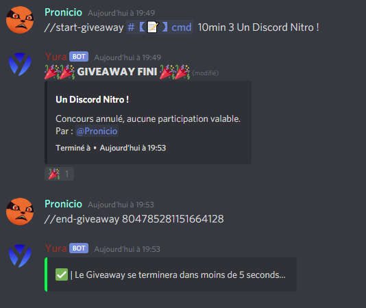
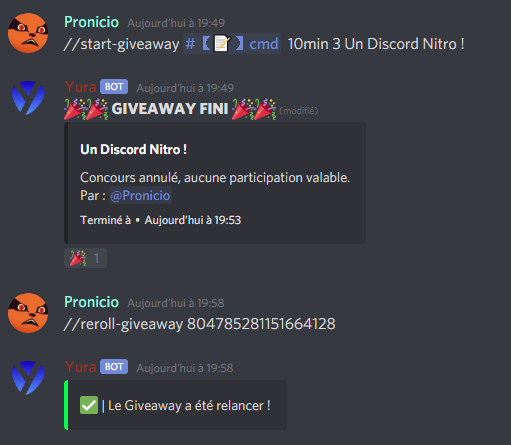
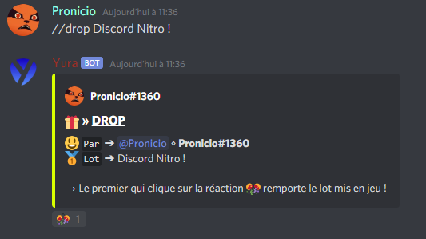

# Système de giveaway :

Le système de backup sert à sauvegarder votre serveur discord et à le cloner sur un autre !

## 🎉 Commande Start 

Pour commencer tapez la commande `//start-giveaway` ou `//s-g` son aliase.  
Commande complète : `//start-giveaway [Channel] [Temps] [Nombre de gagnants] [Prix]`

  

Et voilà ! Maintenant **le giveaway est prêt** !

## 🧩 Commande End

Si vous voulez terminer le giveaway avant la fin tapez la commande `//end-giveaway [Id du giveaway]`.

  

Et voilà ! Maintenant **le giveaway est arrêté** !

## 🧨 Commande Reroll

Vous pouvez relancer le giveaway avec la commande `//reroll-giveaway [Id du giveaway]`.

  

Et voilà ! Maintenant **le giveaway est relancé** !

## 🎊Le système de drop

Dans la catégorie il y a une commande qui permet de 'drop' un prix `//drop [Prix]`.  
**Le premier qui clique sur la réaction gagne le lot !**

  
