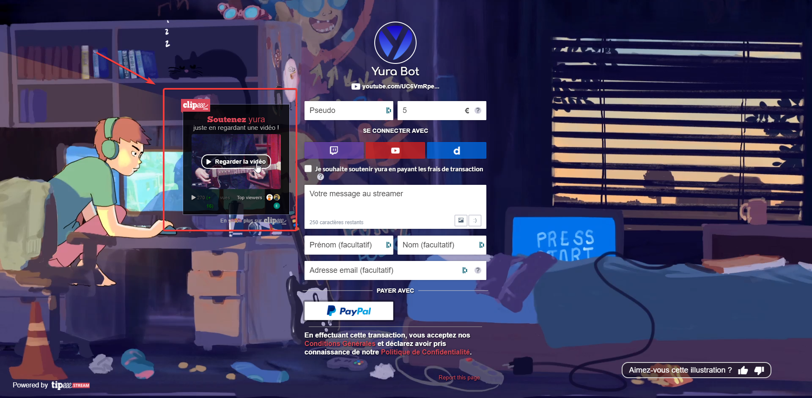
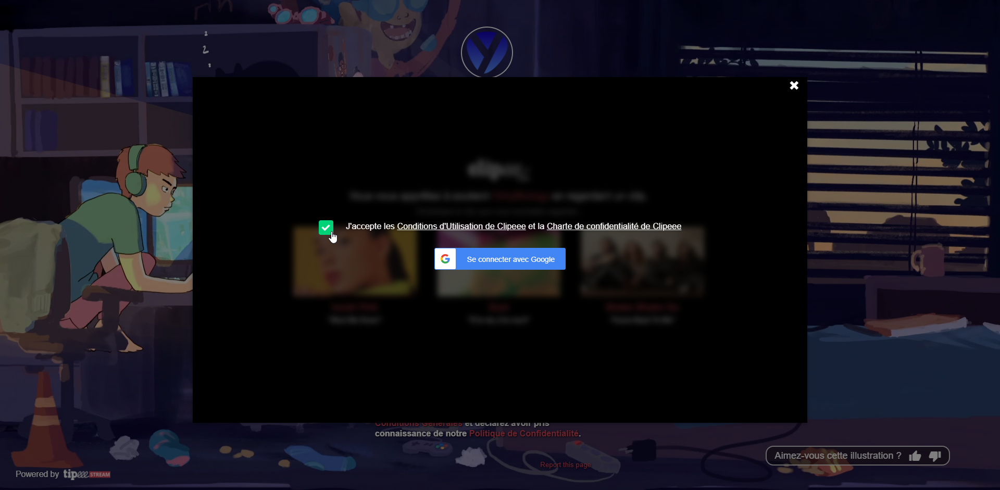
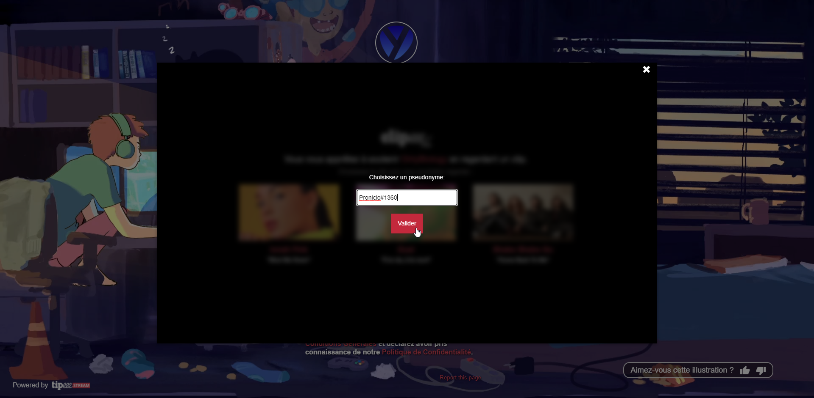
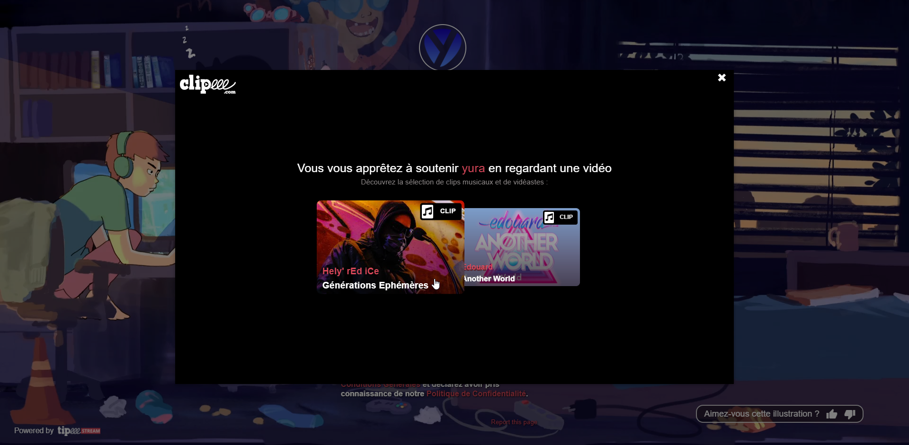
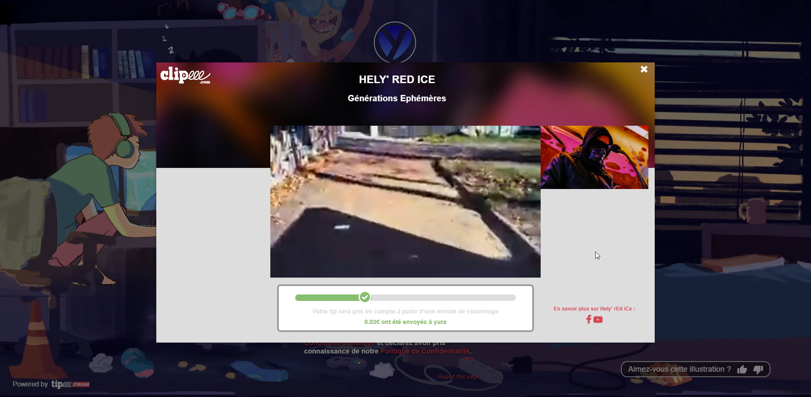
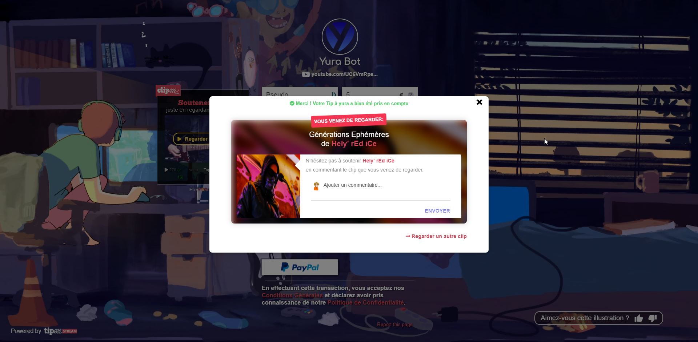
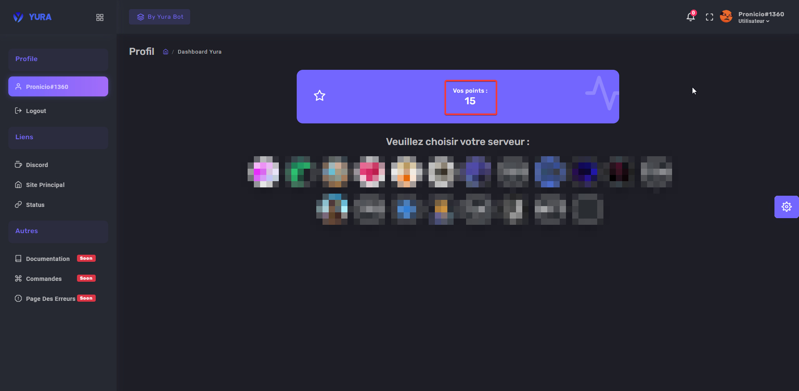

# Les points :

Sur le bot il y a un système de points qui permet d'avoir plus de fonctionnalités sur le bot !  
Les points s'obtiennent 100% gratuitement !

## 📀 Avec clipeee :

Le premier moyen de gagner des points est de **regarder des vidéos sur notre page tipeeestream** [ici](https://www.tipeeestream.com/yura/donation) !  
Une fois sur la page, *à droite*, il y a un cadre et c'est là que se trouve **le module clipeee**.

Vous devez cliquer sur le boutton `Regarder la vidéo` et lier votre compte google :

Pour *lier votre compte discord*, dans la case de votre `pseudo`, mettez simplement votre **TAG DISCORD** :

Maintenant, il y a **plusieurs musiques**, vous choisissez celle que vous voulez :

Pour que les points soient donnés **il faut que vous attendiez 1 min** :

Une fois ce laps de temps écoulé **validez votre vue**, et **vos points apparaîtront sur votre profil** !

  

## D'autres a venir...

Plusieurs autres méthodes viendront après....