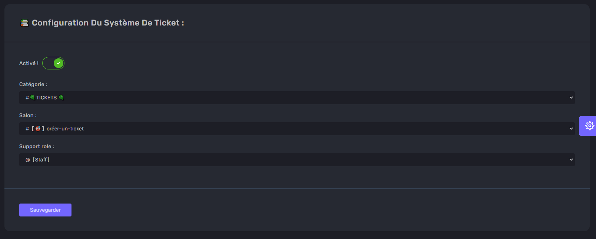
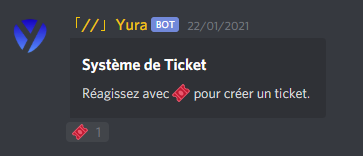
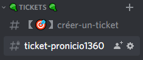
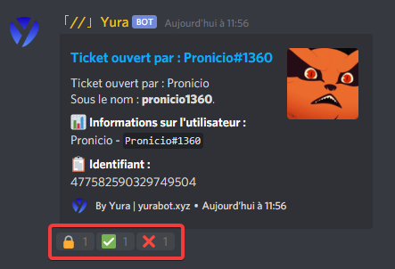

# Système de ticket :

Le système de ticket sert à créer un support dans votre serveur discord !

## 🔩 Configuration :

Vous pouvez choisir **votre catégorie**, **le salon** et **même le role de support** !

  

## ✒️ Pratique :

Une fois configurer **les membres devront cliquer sur la réaction** du message crée automatiquement :

  

**Un salon apparaîtra** et c'est ici que vous pourrez parler !

  

Vous pourrez **gérer le ticket avec le message** du salon :  
La réaction `🔒` **sert a supprimer le ticket** !  
Vous pourrez toujours annuler !

  

